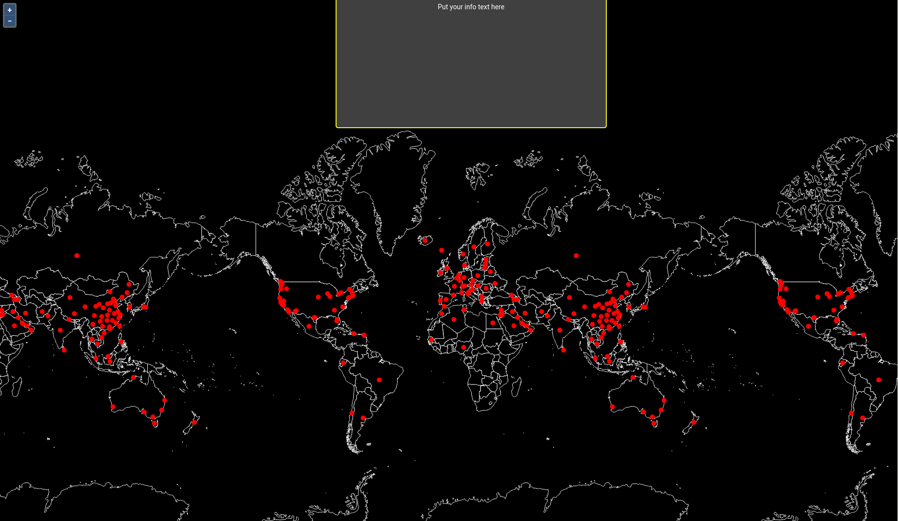

# Layer hinzufügen

In diesem Unterkapitel werden wir der `map` Variable einen weiteren Layer zuweisen (neben dem bereits im Kapitel 2.5 hinzugefügten base-Layer).
<br><br>
Dafür wird der covidDeath Datensatz zunächst importiert (1), der `vector` Variable zugewiesen
und in der `map` Variable referenziert (2).

(1)

```javascript
import covidDeath from "./data/covid-death.json";
var vector = getCovidLayer(covidDeath);
```

> **info**
> Die Funktion `getCovidLayer()` stammt ebenfalls aus der `helper.js` Datei. Auch hier
> ist dieser Schritt für das Verständnis des GeoStylers nicht notwenig. Auf eine genauere
> Erklärung wird hier somit verzichtet.

(2)

```javascript
const map = new OlMap({
  view: new OlView({
    center: center,
    zoom: 2,
    projection: "EPSG:3857"
  }),
  layers: [base, vector],
  interactions: [new DragPan()]
});
```

**Aufgabe 1.**
Erstellen Sie nun einen neuen Ordner mit dem Namen `data` innerhalb des `src`-Ordners.
Fügen Sie anschließend die `covid-death.json` Datei in den `data` Ordner ein.

***Aufgabe 2.***
Wenn Sie nun den Inhalt Ihrer `App.js` Datei erneut mit dem sich unterhalb dieses Abschnittes befindenden
Codes ersetzen und speichern, dann sollte Ihre Anwendunge wie folgt im Browser dargestellt werden:


[](../images/stepThreeImage.png)


```javascript
import React, { useState, useEffect } from "react";

import OlMap from "ol/Map";
import OlView from "ol/View";
import DragPan from "ol/interaction/DragPan";

import isElementInViewport from "./viewportHelper";

import "./App.css";
import "ol/ol.css";
import "antd/dist/antd.css";
import "./Workshop.css";
import Attributions from "./Attributions";
import { getBaseLayer, getCovidLayer } from "./helper";

import { MapComponent } from "@terrestris/react-geo";

import covidDeath from "./data/covid-death.json";

var base = getBaseLayer();
var vector = getCovidLayer(covidDeath);

const center = [0, 8000000];

const map = new OlMap({
  view: new OlView({
    center: center,
    zoom: 2,
    projection: "EPSG:3857"
  }),
  layers: [base, vector],
  interactions: [new DragPan()]
});

function App() {
  let [visibleBox, setVisibleBox] = useState(0);

  useEffect(() => {
    // add scroll eventlistener
    // unfortunately, this will be re-run as soon as visible
    // box changes. Otherwise we don't have visible box in our scope
    const getVisibleBox = () => {
      const boxes = [
        document.getElementById("ws-overlay-1"),
        document.getElementById("ws-overlay-2"),
        document.getElementById("ws-overlay-3")
      ];
      const boxIdx = boxes.findIndex(box => isElementInViewport(box));
      return boxIdx >= 0 ? boxIdx : visibleBox;
    };

    const handleScroll = () => {
      const newVisibleBox = getVisibleBox();
      if (newVisibleBox !== visibleBox) {
        setVisibleBox(newVisibleBox);
      }
    };

    document.addEventListener("scroll", handleScroll);

    handleScroll();

    return () => {
      document.removeEventListener("scroll", handleScroll);
    };
  }, [visibleBox]);

  return (
    <div className='App'>
      <MapComponent map={map} />
      <span id='ws-overlay-1' className='ws-overlay'>
        <h1>Overlay {visibleBox + 1}</h1>
        <p>Put your info text here</p>
      </span>
      <div id='ws-overlay-2' className='ws-overlay'>
        <h1>Overlay {visibleBox + 1}</h1>
        <p>Put your info text here</p>
      </div>
      <div id='ws-overlay-3' className='ws-overlay'>
        <h1>Overlay {visibleBox + 1}</h1>
        <p>Put your info text here</p>
      </div>
      <Attributions />
    </div>
  );
}

export default App;
```
