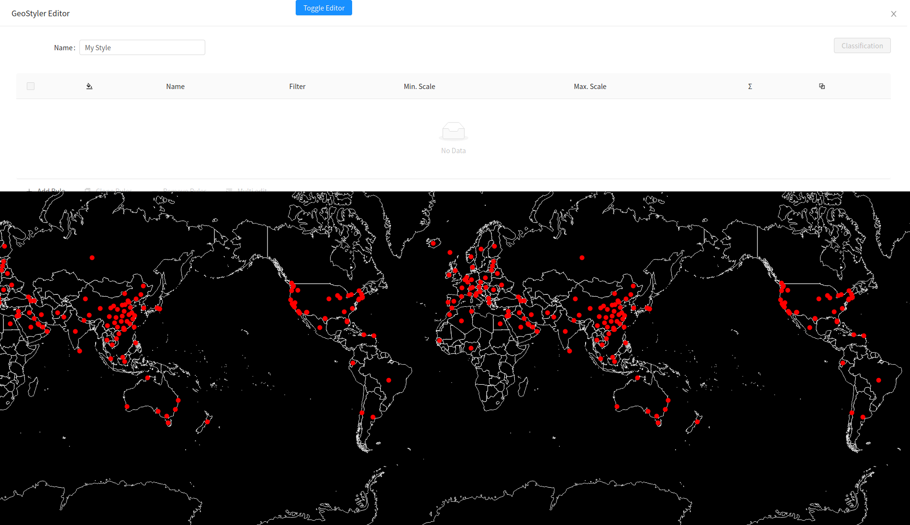

# Wichtige Imports

In diesem Unterkapitel wird der GeoSstyler der Anwendung zugänglich gemacht. 

Die anschließende Einbindung in die Anwendung erfolgt durch den Import:

```javascript
import { Style as GsStyle } from "geostyler";
```

Innerhalb des Drawers, welcher in Kapitel 2.8 hinzugefügt wurde, befindet sich
die oben importierte `<GsStyle />` Komponente (s. folgendender Code-Block). Durch einen 
Klick auf den Button wird somit der Drawer und der Geostyler sichtbar.

```javascript
<Drawer
  title='GeoStyler Editor'
  placement='top'
  closable={true}
  onClose={() => {
    setDrawerVisible(false);
  }}
  visible={drawerVisible}
  mask={false}
>
  <GsStyle compact={true} />
</Drawer>
```

Durch die Einbindung des GeoStylers ist im Grund alles für die Inbetriebnahme gegeben, 
jedoch fehlt hierbei noch die Verknüpfung mit der Applikation und den Daten.
Der Anwendung bedarf es nun den notwendigen Parsern, um SLD bspw. in OpenLayers 
Styles zu überführen. Darauf wird in den folgenden Kapiteln eingegangen.

***Aufgabe 1.***
Importieren Sie den `GeoStyler` und fügen diese in den Drawer ein.

Die Applikation sollte nun wie folgt aussehen:

[](../images/stepFiveImage.png)

Der Code Ihrer Lösung könnte wie folgt aussehen:

```javascript
import React, { useState, useEffect } from "react";

import OlMap from "ol/Map";
import OlView from "ol/View";
import DragPan from "ol/interaction/DragPan";
import { Drawer, Button } from "antd";

import isElementInViewport from "./viewportHelper";

import "./App.css";
import "ol/ol.css";
import "antd/dist/antd.css";
import "./Workshop.css";
import Attributions from "./Attributions";
import { getBaseLayer, getCovidLayer } from "./helper";

import { MapComponent } from "@terrestris/react-geo";

import { Style as GsStyle } from "geostyler";

import covidDeath from "./data/covid-death.json";

var base = getBaseLayer();
var vector = getCovidLayer(covidDeath);

const center = [0, 8000000];

const map = new OlMap({
  view: new OlView({
    center: center,
    zoom: 2,
    projection: "EPSG:3857"
  }),
  layers: [base, vector],
  interactions: [new DragPan()]
});

function App() {
  let [drawerVisible, setDrawerVisible] = useState(false);
  let [visibleBox, setVisibleBox] = useState(0);

  useEffect(() => {
    // add scroll eventlistener
    // unfortunately, this will be re-run as soon as visible
    // box changes. Otherwise we don't have visible box in our scope
    const getVisibleBox = () => {
      const boxes = [
        document.getElementById("ws-overlay-1"),
        document.getElementById("ws-overlay-2"),
        document.getElementById("ws-overlay-3")
      ];
      const boxIdx = boxes.findIndex(box => isElementInViewport(box));
      return boxIdx >= 0 ? boxIdx : visibleBox;
    };

    const handleScroll = () => {
      const newVisibleBox = getVisibleBox();
      if (newVisibleBox !== visibleBox) {
        setVisibleBox(newVisibleBox);
      }
    };

    document.addEventListener("scroll", handleScroll);

    handleScroll();

    return () => {
      document.removeEventListener("scroll", handleScroll);
    };
  }, [visibleBox]);

  return (
    <div className='App'>
      <Button
        className='ws-toggle-editor-btn'
        type='primary'
        onClick={() => {
          setDrawerVisible(currentState => !currentState);
        }}
      >
        Toggle Editor
      </Button>
      <MapComponent map={map} />
      <Drawer
        title='GeoStyler Editor'
        placement='top'
        closable={true}
        onClose={() => {
          setDrawerVisible(false);
        }}
        visible={drawerVisible}
        mask={false}
      >
        <GsStyle compact={true} />
      </Drawer>
      <span id='ws-overlay-1' className='ws-overlay'>
        <h1>Overlay {visibleBox + 1}</h1>
        <p>Put your info text here</p>
      </span>
      <div id='ws-overlay-2' className='ws-overlay'>
        <h1>Overlay {visibleBox + 1}</h1>
        <p>Put your info text here</p>
      </div>
      <div id='ws-overlay-3' className='ws-overlay'>
        <h1>Overlay {visibleBox + 1}</h1>
        <p>Put your info text here</p>
      </div>
      <Attributions />
    </div>
  );
}

export default App;
```

Im nächsten Unterkapitel werden wir einen `default Style` einbinden und einen Parser aus 
der `GeoStyler` Bibliothek importieren.